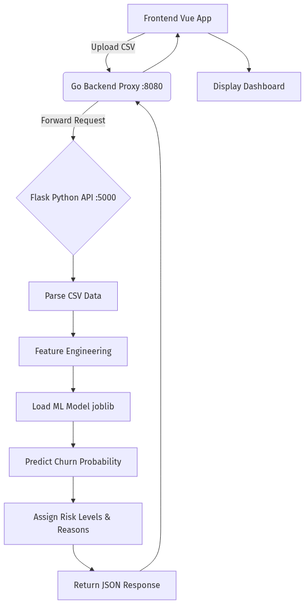
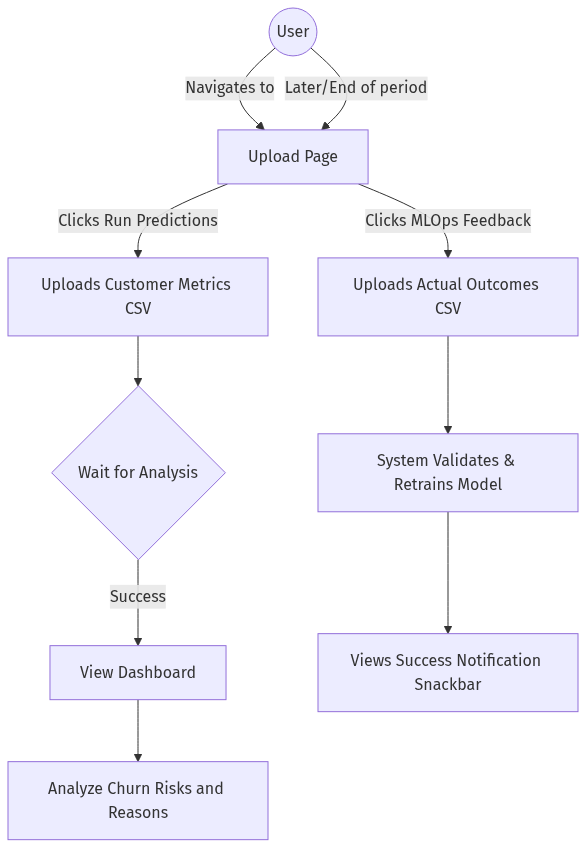
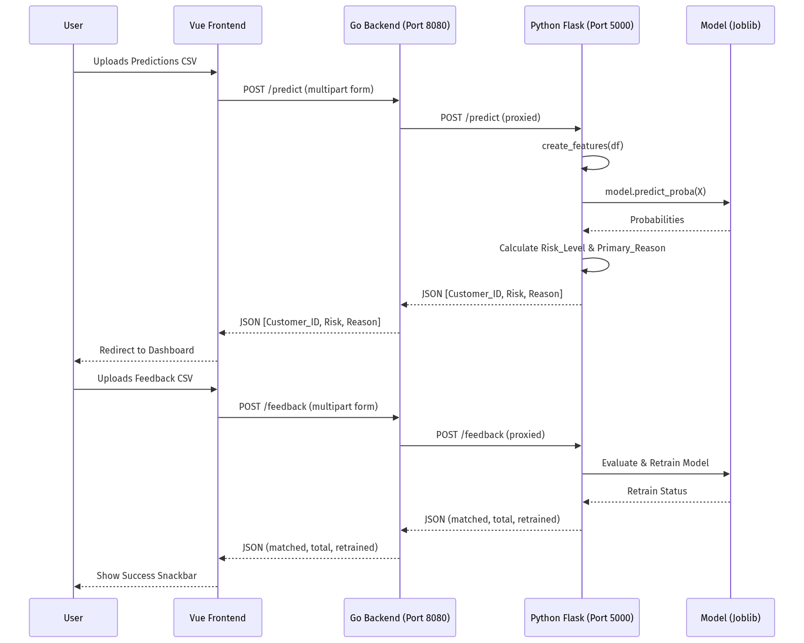

# Churn Intelligence Platform - Project Documentation

## 1. Use Case of the Project
The **Churn Intelligence Platform** is a machine learning-powered system designed to predict customer churn (attrition) and provide actionable insights. The main use cases are:
- **Churn Prediction**: Businesses can upload a batch of customer metrics (CSV format) to predict which customers are at risk of churning.
- **Risk Assessment & Reason Analysis**: The system evaluates the probability of churn, categorizes customers into risk levels (High, Medium, Low Risk), and identifies the primary reason for potential churn (e.g., Low Trading Activity, Login Frequency Drop, High Withdrawals).
- **MLOps Feedback Loop**: Users can upload actual customer outcomes (who actually churned). This feedback is used to automatically evaluate and retrain the machine learning model, ensuring continuous improvement in prediction accuracy.

---

## 2. Flowcharts

### A. Code Flow


**Explanation:**
1. The frontend (Vue.js) accepts a CSV file from the user and sends a multipart/form-data request to the Go backend.
2. The Go backend acts as a proxy, forwarding the file to the Python Flask ML service.
3. The Flask service reads the CSV into a Pandas DataFrame.
4. It performs feature engineering (calculating drops in trades/logins, withdrawal ratios, etc.).
5. The pre-trained ML model (`churn_model.pkl`) predicts the churn probability for each customer.
6. The system categorizes the risk based on thresholds (High > 0.20, Medium > 0.10) and determines the primary reason for churn using business rules.
7. A JSON response containing the probabilities, risk levels, and reasons is sent back through the Go proxy to the Vue frontend, which then displays the results on the Dashboard.

### B. User Flow


**Explanation:**
1. The user starts at the main Upload page (`/`).
2. To get predictions, they select a CSV file containing customer metrics and upload it under the "Run Predictions" section.
3. While the system processes the file, a loading state is shown. Upon success, the user is automatically navigated to the Dashboard.
4. On the Dashboard, the user can view which customers are at risk and prioritize retention efforts.
5. In a later session, when the true outcomes (whether the customer actually churned) are known, the user uploads this data under "MLOps Feedback".
6. The system processes this feedback, matches records, potentially retrains the model, and displays a success notification with the retraining status.

---

## 3. APIs Used

### A. Predict API
- **Endpoint**: `POST /predict` (Frontend calls `:8080/predict` which proxies to `:5000/predict`)
- **Function**: Accepts customer metrics data, runs the churn prediction model, and returns risk analysis.
- **Request**:
  - **Headers**: `Content-Type: multipart/form-data`
  - **Body**: `file` (CSV format containing columns like `Trades_30D`, `Trades_7D`, `Login_30D`, `Login_7D`, `Email_Open_Rate`, `Push_Click_Rate`, `Withdrawals`, `Deposits`, `Portfolio_Value`, `Invested_Amount`).
- **Response** (JSON):
  ```json
  [
    {
      "Customer_ID": "CUST_001",
      "final_churn_probability": 0.25,
      "Risk_Level": "High Risk",
      "Primary_Reason": "Low Trading Activity"
    },
    ...
  ]
  ```

### B. Feedback API
- **Endpoint**: `POST /feedback` (Frontend calls `:8080/feedback` which proxies to `:5000/feedback`)
- **Function**: Accepts actual churn outcomes, evaluates the data, and retrains the machine learning model.
- **Request**:
  - **Headers**: `Content-Type: multipart/form-data`
  - **Body**: `file` (CSV format containing actual outcomes).
- **Response** (JSON - Example):
  ```json
  {
    "matched_customers": 150,
    "total_labeled": 200,
    "retrained": true
  }
  ```

### C. Config API (Get)
- **Endpoint**: `GET /config` (Frontend calls `:8080/config` which proxies to `:5000/config`)
- **Function**: Retrieves current system/model configuration settings.
- **Request**: No body required.
- **Response** (JSON): Configuration key-value pairs.

### D. Config API (Update)
- **Endpoint**: `POST /config` (Frontend calls `:8080/config` which proxies to `:5000/config`)
- **Function**: Updates system/model configuration.
- **Request**: JSON payload with updated configuration values.
- **Response** (JSON): Confirmation of updated settings.

---

## 4. Overall Architecture & API Flow Diagram


